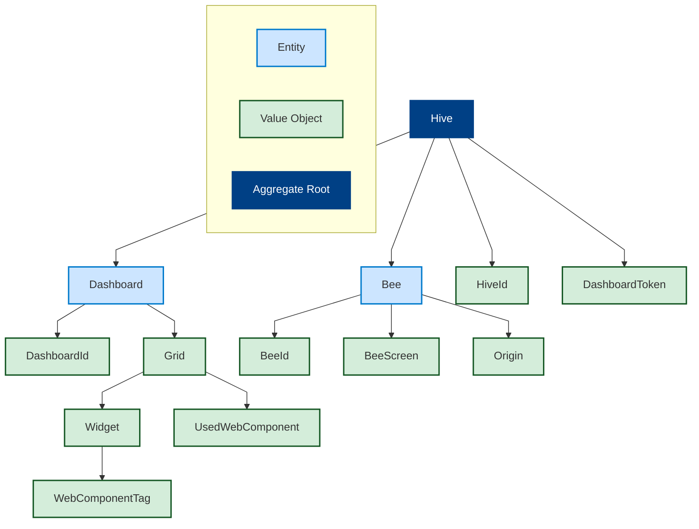

# Fonctionnement basique

# Repositories de l'organisation :
- backend-spring (Java)
- bee (Golang)
- frontend (TypeScript, Vue.js)
- webcomponent-boilerplate (TypeScript, Lit) : Starter permettant de générer rapidement des web components avec Lit et Vite pour les utiliser dans les dashboards
- landing-page (Astro, Vue.js) : Page d'accueil du projet exposée sur Internet
- contracts (déprécié) Initialement utilisé pour partager les clients/serveurs gRPC sous forme de module
- backend (déprécié) Version initiale du back-end écrit en Go, depuis migré en Java

# Backend

## Architecture logicielle
Mix entre une architecture hexagonale et une clean architecture.

## Points notables
Voici quelques points notables du back-end.

### DDD et le choix de MongoDB 
Nous avons modélisé notre modèle en utilisant les patterns tactiques du DDD.
Cette approche permet d'organiser clairement notre métier.

Notre graphique pour l'aggrégat racine. Le principe est de n'interagir avec les entités et objets-valeur que dans le contexte de l'agrégat, pour maintenir la cohérence des données. Nous n'avons qu'un HiveRepository comme point d'entrée métier.

Le choix de MongoDB s'explique par :
- Facilité d'évolution du schéma pendant le développement
- Représentation naturelle de l'agrégat en base de données

Notre architecture permet une éventuelle migration vers un SGBDR en modifiant uniquement la couche de persistance.

### ArchUnit pour les tests d'architecture
Ces tests vérifient le respect des règles de l'architecture hexagonale :
- Domain : `..domain..`
- Application : `..application..`
- Infrastructure : `..infrastructure..`

Règles de dépendance :
- Infrastructure → Domain uniquement
- Application → Domain et Infrastructure
- Domain → Aucune dépendance

### Implémentation des Server-Sent Events comme canal principal de communication back-end → front-end
Voir justification dans la section front-end

### Utilisation de l'AOP pour le HiveAccessControl
Lors de la connexion, le JWT contient la HiveId. L'annotation @HiveAccessControl sur les contrôleurs déclenche :
1. Récupération du JWT
2. Extraction de la HiveId
3. Comparaison avec la HiveId de la requête

Ce mécanisme est appliqué via AOP avant l'exécution des méthodes annotées.

### GlobalExceptionHandler et ProblemDetail
Gestion centralisée des exceptions avec renvoi d'erreurs au format Problem Detail ([RFC 7807](https://datatracker.ietf.org/doc/html/rfc7807)).

### Génération de deux spécifications OpenAPI
Deux groupes de contrôleurs distincts :
- application/http/bee : pour les bees
- application/http/client : pour le front-end

Génération de specs séparées disponible via [l'interface OpenAPI locale](http://localhost:8080/api/v1/api-docs/ui).

# Front-end

## Fonctionnalités
- Connexion à une ruche
- Monitoring :
  - Liste des bees avec :
    - Statut (Hors ligne/En ligne)
    - IP
    - URL active
    - Actions de push (dashboard, URL, page d'accueil)
- Gestion des dashboards :
  - Création/renommage
  - Ajout/modification de widgets
  - 📌 TODO : Prévisualisation

## Technologies
- Vite
- Vue.js 3
- Tailwind CSS
- Gridstack
- Widgets en web components Lit

## Widgets
Les composants sont :
1. Bundlés en fichier JS unique
2. Référencés dans un JSON
3. Chargés dynamiquement via balises personnalisées

## Dashboards
Chaque dashboard :
- Utilise Gridstack pour le layout
- Persiste automatiquement les modifications au back-end
- Stocke la configuration des widgets (taille, position)

## Page de monitoring
- Rafraîchissement temps réel via SSE
- Pas de polling → meilleure performance
- Mise à jour automatique des états des bees

# Bee

Agent léger en Golang avec :
- Instance Chromium via Playwright (solution temporaire)
- Endpoints :
  - `/health` : vérification d'état
  - `/push-url/wait-screen` : écran d'attente
  - `/push-url` : navigation vers URL

Gestion des erreurs remontées au back-end via SSE

# Évolution de l'architecture
## Problématique
Le back-end stateful dû aux SSE limite le scaling horizontal.

## Solution proposée

- Introduction de RabbitMQ
- Service dédié pour les notifications SSE
- Découplage du back-end principal

## Raisons du non-implémentation
- Charge actuelle faible → scaling inutile
- Complexité accrue (6 services au lieu de 3)
- Portabilité réduite

Ce document a été corrigé grammaticalement tout en préservant les termes techniques et l'intention originale.
