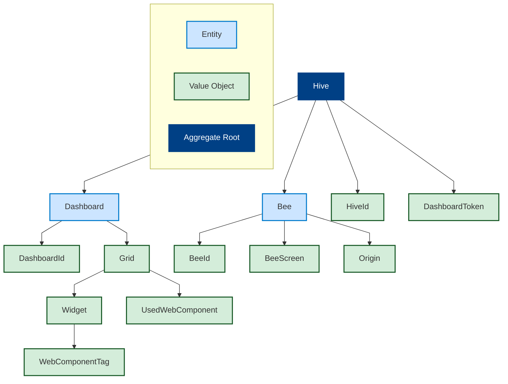

# Fonctionnement basique

# Repositories de l'organisation : 
- **backend-spring** (Java)  
- **bee** (Go)  
- **frontend** (TypeScript, Vue.js)  
- **webcomponent-boilerplate** (TypeScript, Lit) : Starter permettant de générer rapidement des web components avec Lit et Vite, pour une utilisation dans les dashboards.  
- **landing-page** (Astro, Vue.js) : Page d'accueil du projet, exposée sur Internet  
- **contracts** (déprécié) : Initialement utilisé pour partager les clients/serveurs gRPC en tant que module  
- **backend** (déprécié) : Version initiale du back-end écrit en Go, depuis migré vers Java  

# Backend

## Architecture logicielle
Combinaison d'architectures hexagonale et clean.  

## Points notables
Voici les principaux éléments marquants du backend.

### DDD et le choix de MongoDB
Nous avons modélisé notre *modèle* métier en utilisant les _patterns_ tactiques du DDD.  
Cette approche permet de structurer notre logique métier de manière organisée.

Voici notre graphique pour notre agrégat racine.

Le principe est de pouvoir agir sur les entités et les value objects de notre agrégat uniquement dans le contexte de l’agrégat. Afin de conserver une cohérence dans nos données et de simplifier le développement, notre agrégat racine (Hive) constitue le seul point d’entrée pour la logique métier de notre application. On note que nous disposons d’un unique `HiveRepository` (domain/port/HiveRepository), ce qui nous oblige à passer par Hive pour effectuer les interactions métier.

## Choix de MongoDB

Le choix de MongoDB a été fait pour deux raisons :

- Facilité lors de la phase de développement pour l’ajout et la suppression de champs. La base est moins coûteuse en temps à maintenir, et il n’y a pas de migration de schéma à effectuer. Étant dans une phase d’émergence de notre domaine, notre choix s’est naturellement porté sur MongoDB.  
- Représentation fidèle de notre agrégat en base : notre collection calque presque parfaitement notre modèle, ce qui nous facilite encore le travail.

À noter que, de par notre architecture, le passage, si nécessaire, vers un SGBDR se fera assez rapidement, car il n’y aura qu’à remplacer la couche de persistance et les adaptateurs.

### ArchUnit pour les tests d’architecture

Ce test utilise ArchUnit pour vérifier le respect des règles de l’architecture hexagonale dans le projet. Il définit trois couches :

- `domain`        : `..domain..`  
- `application`   : `..application..`  
- `infrastructure`: `..infrastructure..`  

Règles de dépendance entre les couches :

- infrastructure ➡️ peut uniquement accéder à domain  
- application   ➡️ peut accéder à domain et infrastructure  
- domain        ❌ ne peut accéder à aucune autre couche  

L’objectif est de garantir une séparation claire des responsabilités et de prévenir les dépendances circulaires.

### Implémentation des Server-Sent Events comme vecteur principal de communication backend → front
Voir la justification dans la partie front.

### Utilisation de l’Aspect-Oriented Programming pour le HiveAccessControl
Lors de la connexion, on renvoie à l’utilisateur un JWT contenant sa HiveId.  
Pour empêcher un utilisateur doté d’un JWT valide d’accéder à une autre hive, nous avons mis en place l’annotation `@HiveAccessControl` sur les méthodes des contrôleurs concernés.  
Grâce à l’[AOP](https://fr.wikipedia.org/wiki/Programmation_orient%C3%A9e_aspect), nous appliquons, en amont de chaque appel, le traitement suivant :  
- Récupération du JWT  
- Extraction de la HiveId dans le JWT  
- Récupération de la HiveId dans la requête  
- Comparaison de ces deux valeurs  

Cela nous permet d’activer ce contrôle simplement en ajoutant une annotation sur l’endpoint.

### GlobalExceptionHandler et ProblemDetail
Nous centralisons la gestion des exceptions dans `application/http/GlobalExceptionHandler`.  
L’idée est d’intercepter les exceptions annotées par `@ExceptionHandler` et de renvoyer un message d’erreur structuré.  
Nous avons choisi de renvoyer un `ProblemDetail` ([RFC 7807](https://datatracker.ietf.org/doc/html/rfc7807)), qui devrait devenir un standard pour les messages d’erreur d’API.

### Génération de deux specs OpenAPI
En tant que backend, nous avons deux types d’acteurs : les bees et les clients front.  
Pour cela, nous avons séparé nos contrôleurs en deux packages :  
- `application/http/bee`  
- `application/http/client`  

Nous générons ainsi deux specs OpenAPI, spécifiques à chaque acteur.  
Elles sont disponibles ici :  
[Lien OpenAPI en local](http://localhost:8080/api/v1/api-docs/ui)  

La configuration de cette séparation se fait dans `application/http/OpenApiConfig`, selon les routes.

# Front-end

## Fonctionnalités
- Page de connexion à une hive  
- Page de monitoring  
  - Liste des bees de la hive  
    - Statut (hors-ligne / en ligne)  
    - IP  
    - URL actuelle  
    - Pousser un dashboard  
    - Pousser une URL  
    - Pousser la page d’accueil  
- Page des dashboards  
  - Création d’un dashboard  
  - Renommage  
  - Téléchargement / insertion de widgets  
  - Modification du layout  
  - 📌 TODO : prévisualisation du dashboard  
- Déconnexion de la hive  
- Affichage de l’identifiant technique (HiveId)

## Technos
Stack front :  
- Vite  
- Vue.js  
- Tailwind CSS  
- Gridstack  

Widgets :  
- Web-composants Lit bundlés en un fichier JavaScript unique (Vite)

## Les widgets
Les web-composants, une fois bundlés, sont placés dans un dossier du projet et référencés dans un fichier JSON.  
L’objectif à terme est de disposer d’un registre cloud pour ces composants.

Pour utiliser un web-composant :  
1. Récupérer le script correspondant  
2. L’insérer dans le DOM  
3. Utiliser la balise créée (ex. `<mon-composant></mon-composant>`)

## Les dashboards
Un dashboard est une liste de widgets (chaque widget associe un web-composant à ses données de taille et de position).  
Nous utilisons Gridstack pour modéliser les widgets : position, taille.  
À chaque mise à jour d’un dashboard (ex. déplacement d’un widget), il est persisté côté backend pour un rafraîchissement quasi instantané.

## La page monitoring
La page de monitoring, critique et nécessitant une forte réactivité, est connectée en SSE.  
Son contenu se met à jour automatiquement dès que le backend signale une modification : connexion d’une nouvelle bee, changement de statut, etc.  
Ce mécanisme évite le polling et ses contraintes de performance côté front et back.

# Bee
La bee est un composant central de BeeOps : c’est l’agent qui exécute les instructions d’affichage.  
Conçue pour être légère, performante et multiplateforme, elle est développée en Go.

Au démarrage, la bee lance une instance de Chromium via Playwright : une solution de facilité, amenée à évoluer pour alléger le système.  

Endpoints exposés :  
- `/health`               : vérifie l’état de la bee  
- `/push-url/wait-screen`: affiche un écran d’attente  
- `/push-url`            : affiche une URL donnée  

En cas d’erreur, la bee la signale au backend, qui utilise SSE pour en informer l’utilisateur.

# Ouverture sur l’architecture

## Problématique
Les sessions HTTP liées aux Server-Sent Events rendent le backend stateful,  
ce qui empêche le scaling horizontal des réplicas.

## Solution
  
- Introduire RabbitMQ et un service de notification dédié aux SSE (stateful).  
- Le backend publie les messages sur RabbitMQ,  
  le service SSE les consomme et les relaie au front.

## Pourquoi ne pas la mettre en place
- Faible charge : pas de besoin immédiat de scalabilité.  
- Complexité accrue : de 3 à 6 services, ce qui réduit la portabilité du SI.  
