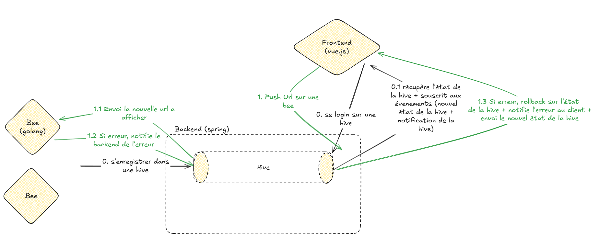
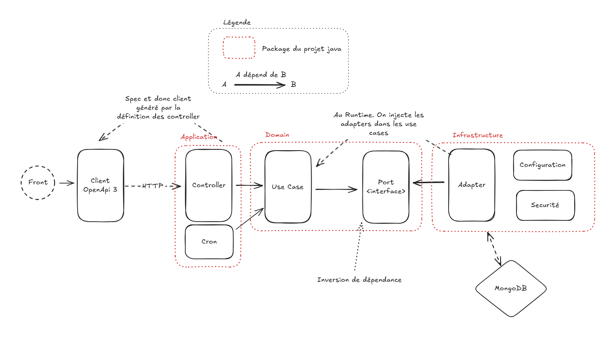
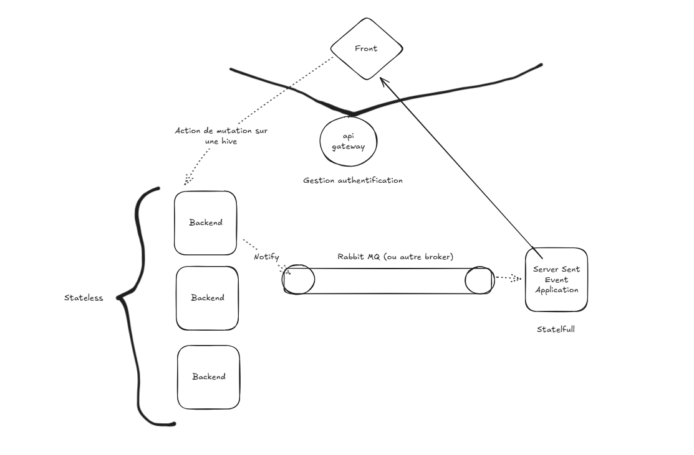

# Fonctionnement basique

# Repositories de l'organisation : 
- backend-spring (java)
- bee (golang)
- frontend (typescript, vuejs)
- webcomponent-boilerplate (typescript, lit) : Starter permettant de rapidement générer des web components avec lit et vite. Afin de les utiliser dans les dashboards.
- landing-page (astro, vuejs) : Page d'accueil de projet, exposé sur internet
- contracts (deprecated) Utilisé a la base pour partager en tant que module, les clients/serveurs grpc
- backend (deprecated) Version initiale du backend écrit en go, depuis migré en java

# Backend

## Architecture logicielle
Mix entre une architecture hexagonale et une clean architecture.

## Point notable
Voici les quelques points notables du backend.

### Choix de mongodb et DDD

### ArchUnit pour les tests d'achitectures
Ce test utilise ArchUnit pour vérifier le respect des règles de l'archi hexagonale dans le projet. Il définit trois couches :

- domain : `..domain..`
- application : `..application..`
- infrastructure : `..infrastructure..`

Règles de dépendance entre couches :

- infrastructure ➡️ peut uniquement accéder à domain
- application ➡️ peut accéder à domain et infrastructure
- domain ❌ ne peut accéder à aucune autre couche

L’objectif est de garantir une séparation claire des responsabilités et de prévenir les dépendances circulaires.

### Implémentation de server sent event comme vecteur principal de communication backend -> front.
Voir justification front

### Utilisation de l'Aspect Oriented Programming pour le HiveAccessControl
Lors de la connection, on renvoi a l'utilisateur un JWT avec dedans sa HiveId.
Afin de faire en sorte qu'un utilisateur avec un JWT valide ne puisse pas accéder a une autre hive. On a mis en place l'annotation @HiveAccessControl sur les méthodes des controllers concerné.
Sur ces méthodes, grâce a l'[AOP](https://fr.wikipedia.org/wiki/Programmation_orient%C3%A9e_aspect), on va appliquer en ammont de chaque appel de la méthode, le traitement suivant : 

- Récupération du JWT
- Récupération de la HiveId dans le JWT
- Récupération du HiveId de la requête
- Comparaison de ces deux champs.

Cela nous permet d'appliquer ce comportement uniquement en apposant une annotation sur notre endpoint

### GlobalExceptionHandler et ProblemDetail
On a centraliser la gestion des exception dans le fichier application/http/GlobalExceptionHandler.
L'idée est de catcher l'exception noté par @ExceptionHandler, et de renvoyer un message d'erreur.
On fait le choix de renvoyer un ProblemDetail ([RFC 7807](https://datatracker.ietf.org/doc/html/rfc7807)), qui s'annonce comme être un futur standard des messages d'erreurs d'api.

### Génération des deux specs open api.
En tant que backend, on a deux type d'acteurs qui peuvent nous contacter. Les bees, et les clients fronts.

Nous avons fais le choix de séparer nos controllers en deux (application/http/bee & application/http/client pour le front).
La raison de ça c'est de pouvoir générer 2 specs open api spécifiques a chaque acteurs.

Elles sont disponibles sur ce lien ([LienOpen Api en local sur le back](http://localhost:8080/api/v1/api-docs/ui)).
La séparation se fait dans la classe application/http/OpenApiConfig en fonction des routes.

# Frond-end

## Fonctionnalités

- Page de connexion à une hive
- Page de monitoring
  - Liste des bees de la hive
    - Statut de la bee (Hors/En ligne)
    - IP de la bee
    - URL actuelle
    - Pousser un dashboard
    - Pousser une URL
    - Pousser la page d'accueil
- Page des dashboard

  - Création d'un dashboard
    - Renommage d'un dashboard
    - Téléchargement / insertion de widgets
    - Modification du layout
    - 📌 TODO Préviusalisation du dashboard

- Déconnexion de la hive
- Afficher son identifiant technique (ID de la Hive)

## Technos

Stack front :

- Vite
- Vue.js
- Tailwind CSS
- Gridstack

Widgets :

- Webcomposants lit bundlés en un fichier Javascript unique avec Vite

## Les widgets

Les webcomposants une fois bundlés sont mis dans un dossier du projet front et référencés dans un fichier JSON. L'objectif plus tard sera d'avoir un registre dans le cloud pour ces composants.

Pour utiliser un webcomposant le principe est simple :

1. Récupérer le script correspondant
2. Insérer ce script dans le DOM
3. Utiliser la balise créée dans ce script ex: `<mon-composant></mon-composant>`

## Les dashboards

Fonctionnelement un dashboard est une liste de widgets (un widget est l'association d'un webcomposant et de ses données de taille et de positionnement dans une grille), on représente ces widgets dans une grille Gridstack nous permettant de les modeler à notre guise : position, taille. A chaque fois qu'un dashboard est mis à jour (ex: un widget est déplacé), celui-ci est persisté côté back afin d'avoir un résultat quasi instantané.

## La page monitoring

La page de monitoring (page où sont affichées toutes les bees d'une hive), de part sa criticité et de son besoin de réactivité est connectée en mode Server-Sent-Event, c'est à dire que son contenu est réactualisé sans la moindre action utilisateur dès que le back nous signale des modifications : ex connection d'une nouvelle bee, passage Hors/En-ligne d'une bee, ... Le tout en évitant un système de polling qui pourrait poser des problèmes de performances côté front ou back.

# Bee

La bee est un composant majeur du système BeeOps: il s'agit de l'agent qui va recevoir les instructions d'affichage des utilisateurs.

Ce composant est destiné à être léger, performant et indépendant de tel ou tel système d'exploitation, Go s'est donc désigné comme notre techno de choix pour sa réalisation.

Au démarrage d'une bee celle-ci va lancer une instance Chromium avec l'aide du moteur de test Playwright. Il s'agit d'une solution de facilité qui sera destiné à être changée car cela alourdit ce système destiné à être léger

Elle expose les endpoints suivants, permettant de la controller :

- `/health` : Permet de vérifier l'état de connexion d'une bee
- `/push-url/wait-screen` : Permet de pousser l'écran d'attente
- `/push-url` : Permet de pousser une URL de choix

La bee est également capable en cas d'erreur de son côté, de le signaler au back, qui lui même grace au SSE, va en avertir l'utilisateur

# Ouverture sur l'architecture
## Problématique
A cause des sessions http de server sent event, notre backend devient statefull.
- Impossible donc de scaler des réplicas.

## Solution

- Mettre un RabbitMQ entre un nouveau service pour la notification et notamment le server sent event (qui lui est statefull).
- Ce rabbitMq est branché au backend qui va envoyer les messages dans le bus, afin qu'ils soient consommés par le service de server sent event, et envoyé au front.

## Pourquoi on le met pas en place
- Manque d'utilisateur/charge => Pas nécessaire de pouvoir scaler le backend, car notre service n'est pas sensé recevoir de la charge.
- Complexité du SI: Passage de 3 services a 6, ce qui rend de moins en moins portable le service.
